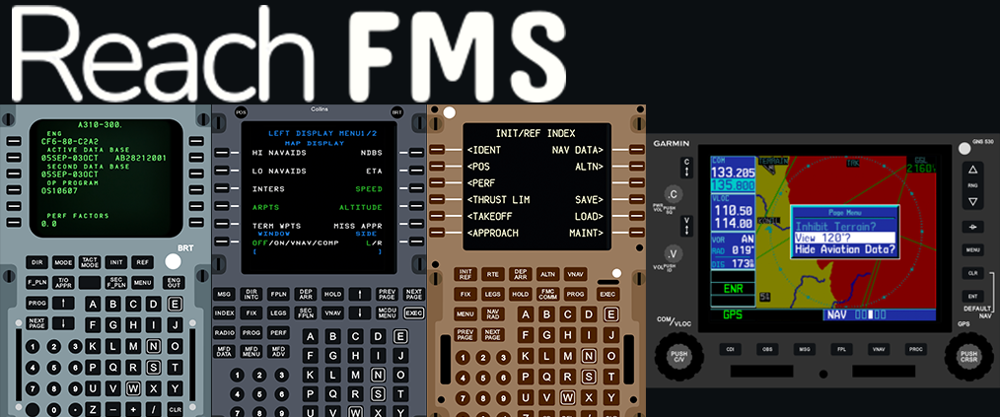

 <div align="center">
  <picture>
    
  </picture>
</div>


# ReachFMS

A lightweight, easy to use universal FMS for Microsoft Flight Simulator. You can access a remote FMS for your favorite aircrafts with just a single app.
I always aimed for a very lightweight operation of the app throughout the development, the app should only use 0.1-1% of your CPU even on lower end systems, and if even this is still too much for you, you can always reduce the refresh rate of the FMS display stream.


## Run Locally

Clone the project

```bash
  git clone https://github.com/kisbAlt/ReachFMS
```

Go to the project directory

```bash
  cd ReachFMS
```

First you need to build the react front end of the application. Only then could the build be compiled into the .exe

```bash
  cd frontend
  npm install
  npm run build
```

You can now build the main_app rust application. You will need rust installed on your system

```bash
  cd ../main_app
  # This will build a release version. This can take a few minutes depending on your system
  # If you only want a debug build remove the --release parameter
  cargo build --release
```


